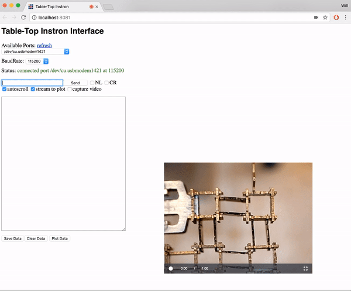
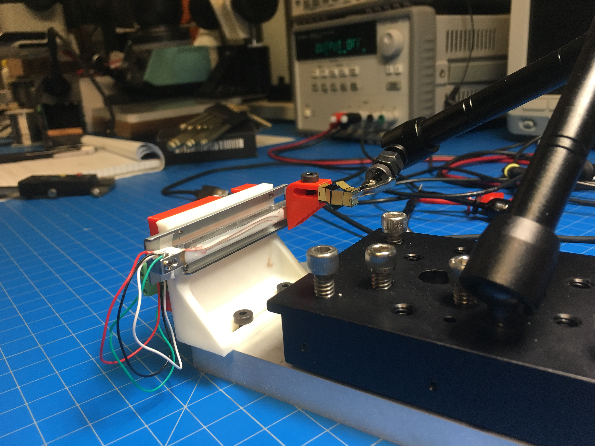
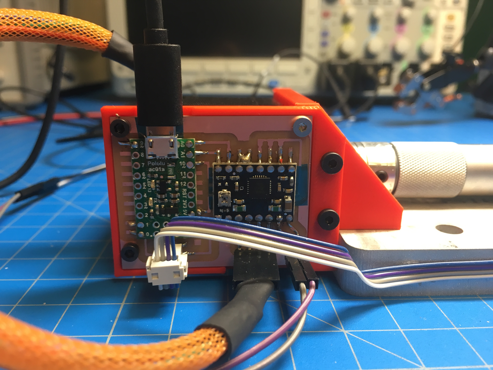
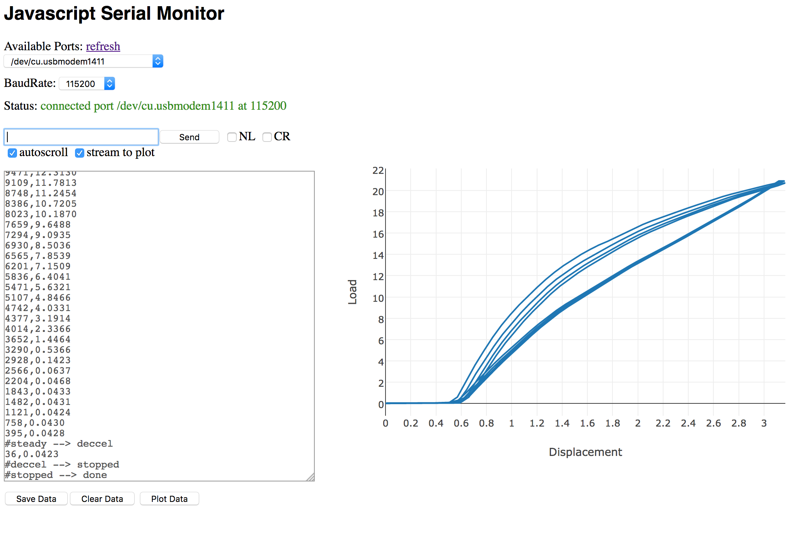

<a class="title" href="../index.html" style="margin-left:10px"><h3>&larr; Will Makes Things.</h3></a>

# Tabletop Materials Testing, 2017

I made a table-top instron to explore very small force-displacement relationships.

<!---->

#### Motion Stage
For the motion stage, I'm relying on the ubiquity of <a href="https://www.thorlabs.com/newgrouppage9.cfm?objectgroup_id=10211">precision micrometer stages</a> just lying around our lab. By boring out a helical coupling, I can very easily attach the end of the micrometer to a stepper motor. This setup allows for very fine position control: every 1/16 microstep of the stepper motor results in 0.198um of linear motion.

In order to ensure smooth motion, I've implemented a method for accelerating and decelerating the stepper that's discussed in [this paper](http://www.hwml.com/leibramp.pdf). This is the simplest and cheapest (computationally) stepper acceleration algorithm that I've come across. I implement it with a basic finite step machine that keeps track of whether the stepper is acclerating, decelerating, steadily-moving, or stopped. Then, in a timer interrupt which triggers at 256 Hz, I update the step delay depending on this state. Each step is periodially toggled by checking `if (micros()-last_time > step_delay)`.

#### Load Cell

I'm using the load cell out of a <a href="https://www.amazon.com/American-Weigh-GEMINI-20-Portable-MilliGram/dp/B0012TDNAM/">low cost milligram scale</a> which has a range of 20g and a purported resolution of 1mg.

 

Instead of relying on their electronics with unknown resolution and calibration, I'm using my own 24-bit ADC and amplifier (<a href="http://www.ti.com/product/ADS1231">TI ADS1231</a>) to read the load cell. By oversampling 16x and decimating (see <a href="http://www.atmel.com/images/doc8003.pdf">this nice app note</a>), I can achieve better than 10mg resolution with noise on the order of 1mg (I think the original 1mg spec was a bit of a stretch).
	
#### Interface

To interface with the hardware, I built a javascript/node interface. The interface extends the [javascript serial monitor](https://gitlab.cba.mit.edu/langfordw/javascriptSerialMonitor) that I made previously. It's essentially a fancy serial monitor that enables commands to be sent to the machine and for data to be read back and plotted in realtime.

<!---->

For plotting I'm using [plotlyjs](https://plot.ly/javascript/) and for webcam streaming and recording I'm using [videojs-record](https://github.com/collab-project/videojs-record) (which is great, except that changing the size/resolution of the capture appears to be broken at the moment).

#### Applications

I'm using this machine to characterize the stiffness of small-scale flexural mechanisms, as well as the force output from electromagnetic actuators.

