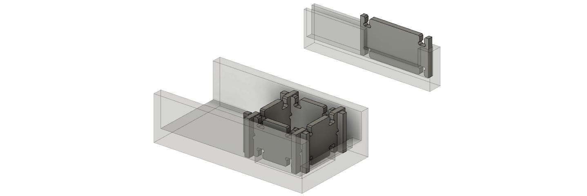
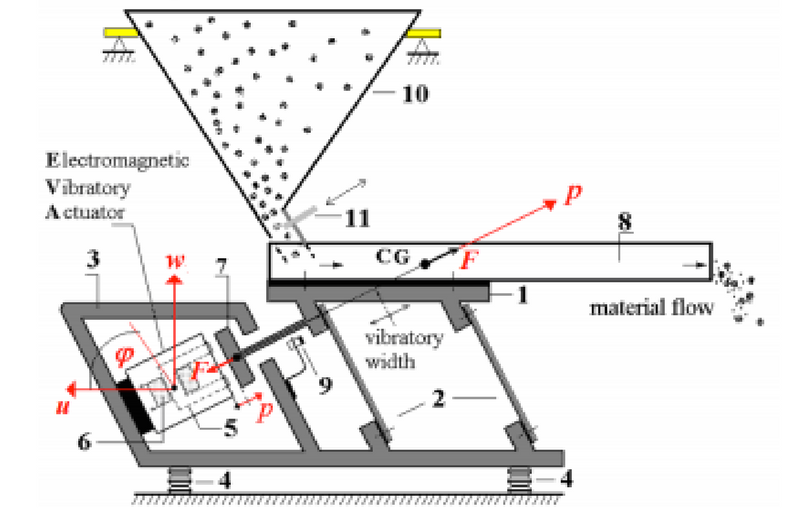
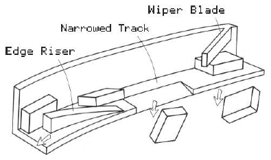
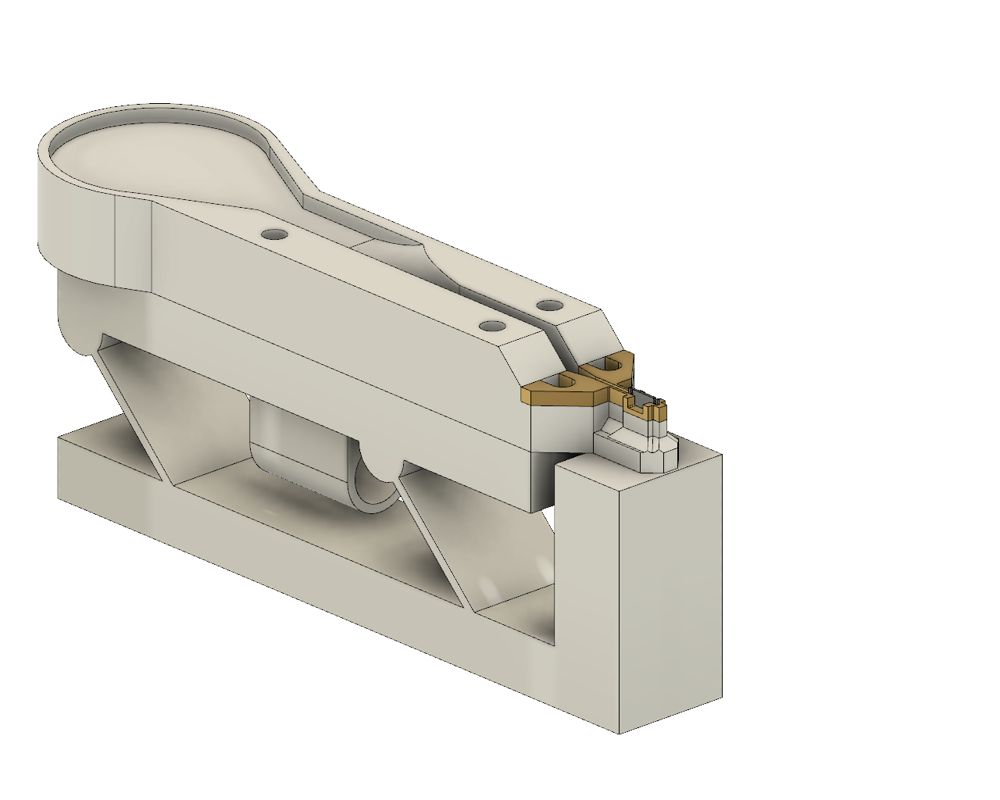
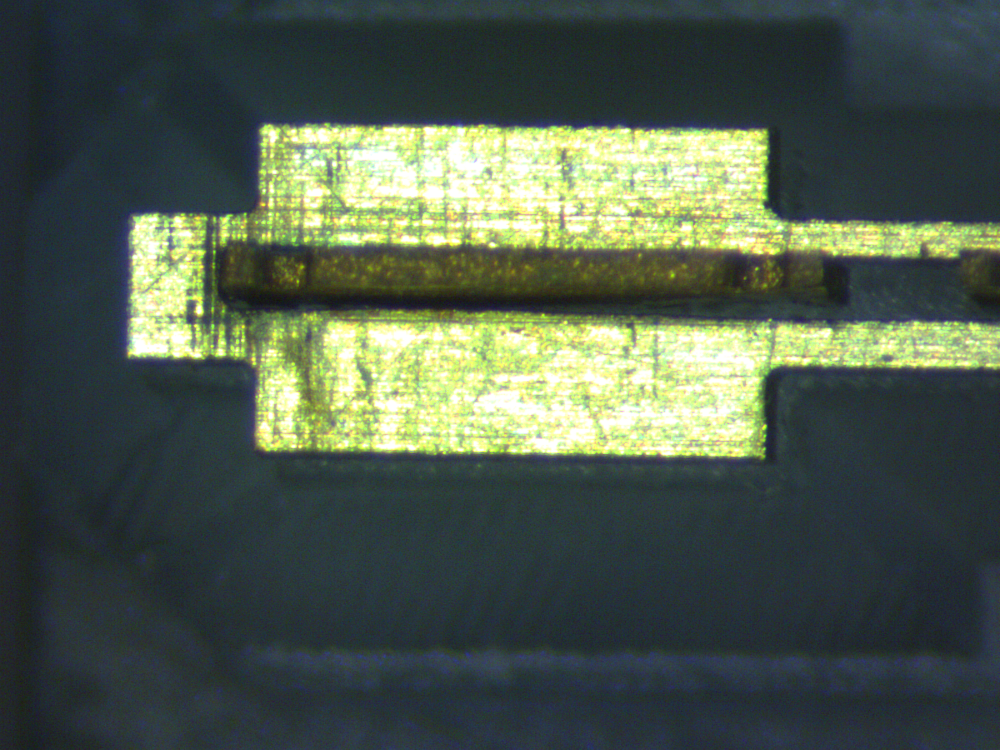
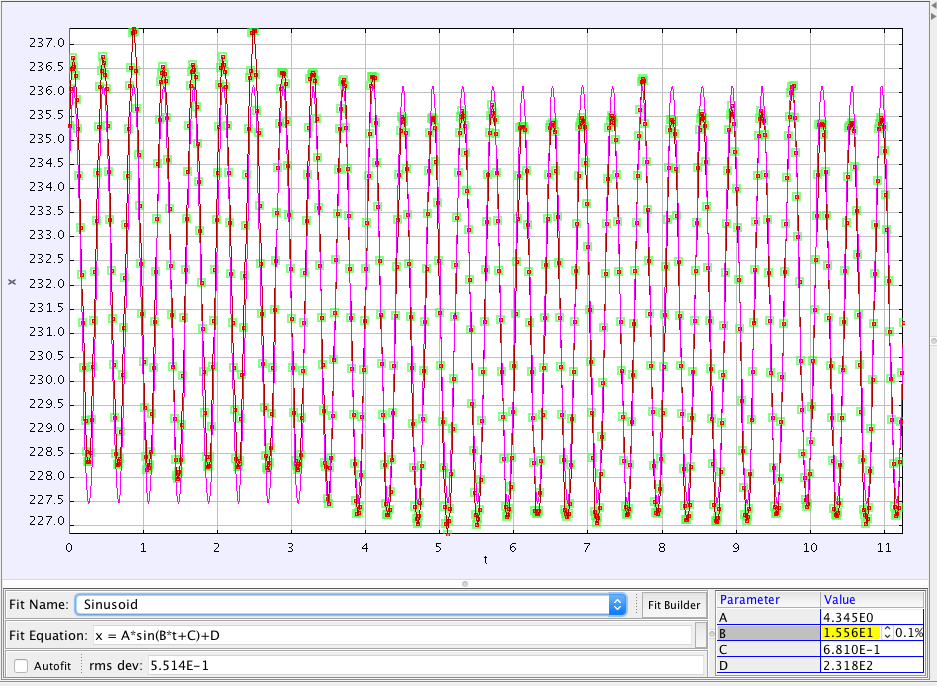
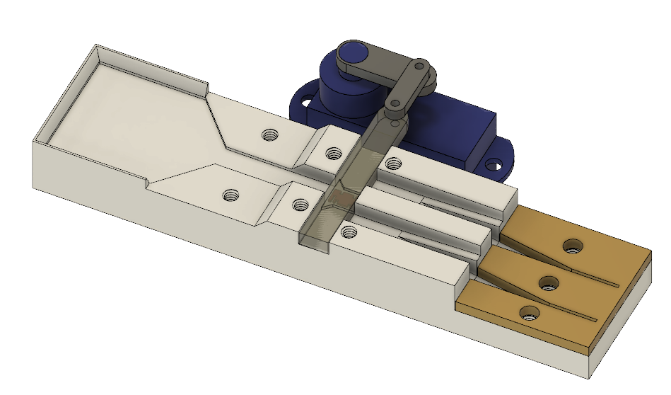
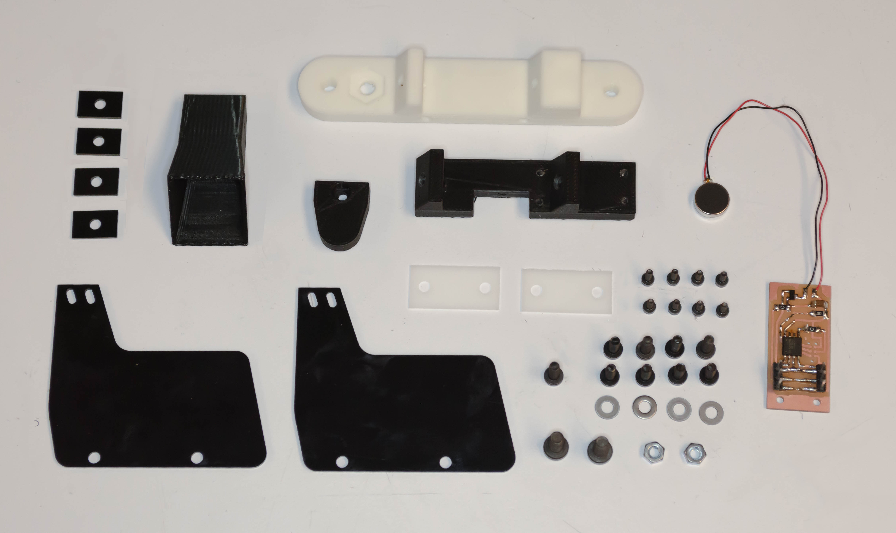

## Part Feeding

### Design

I think it makes most sense to separate the tasks of part feeding and pickup/placement. Magazines take a long time to load and have a limited capacity. Instead, I'd like to use something like vibratory feeders that can take a bin full of parts, orient them, and feed them to a pickup location.

It would even be fairly trivial to assemble the vibratory feeders from the discrete parts. Of course, a smooth top surface would be a necessary addition.

I would like to present the nodes and struts like this:

A number of interesting techniques exists for conveying these kinds of small parts. Here are a few examples

- [Drum Feeder](https://www.youtube.com/watch?v=HA32I04o-to)
- [Vibratory Feeder](https://www.youtube.com/watch?v=no0fPTZoSNs)
- [Crazy screw drives](https://www.youtube.com/watch?v=P1deyoFsFKE)
- [DIY Vibratory Chip Feeder](https://www.briandorey.com/post/diy-pick-and-place-v2-vibratory-chip-feeder)
- [3-axis vibratory feeders](https://www.asyril.com/en/products/asycube-flexible-feeders.html#asycube_530) [with vision feedback](https://www.youtube.com/watch?v=VQgi4ev1nqY)

I decided to start with a linear vibratory feeder. The idea is to vibrate the linear tray with springs that orient the vibration in such a way that the parts move in the desired direction. They look something like this:

To control the orientation of parts, you can do all sorts of various tricks. [This website](http://www.autodev.com/vibratory-feeder-bowl-orienting-part-shapes) has nice documentation on how to orient a number of different shapes.

### Strut Feeder

#### Initial Prototype

I get good part conveyance at 0.675V which corresponds to 6500RPM (108Hz). This seems to be just below the resonance point of 7150RPM (120Hz).

The feeder I designed originally for the 1/32" strut parts turns out to work well with the small scale struts. I just need a narrower channel at the very end to get them single file.

The surface does play an important role. While it works okay on a FDM printed surface, it's better formlabs printed surfaces, and much better on the black gaffer tape. The black gaffer tape was the only surface that enabled the feeder to be significantly tilted in the wrong direction and for the parts to still climb. This is likely because it provides a much higher friction surface. I wonder about a surface that has even more friction like PDMS or silicone.

Holding the end of the feeder rigidly does significantly impact the part conveyance. This can be adapted to in some respect by increasing the voltage (and speed) of the vibrating motor to pump more energy in. However, this seems like it would be incredibly sensitive to the degree to which the head is fixed. It might therefore be a better idea to keep the head isolated but provide support nearby for when part pickup happens. For example, a solid ledge could be put just under it so that the toolhead displaces the feed head momentarily but then buts up against the solid ledge.

#### Simulating

Modal analysis of the structure made has the first mode at anywhere between 70Hz and 140Hz depending on the material.
 * With "PC/ABS" the first mode occurs at 137Hz.
 * with steel top part and aluminum flexure: first mode at 128Hz (7.6 krpm)
 * with PC/ABS top part and aluminum flexure: first mode at 257Hz (15.4 krpm)

#### Refined Prototype

After a few iterations, I came across a design which uses an EDM-cut insert that achieves the final ~10mil slot for the part to fit in.

<video controls width="500px" src="video/strut_feeder_converted.mp4"></video>

 

The feeder works well with a steady stream of parts but tends to clog at the inlet to the 1 part-thickness region. We might be able to resolve this by moving the single-part region further upstream.

<!-- #### Misalignment

I've noticed that the strut is not centered in its pickup location. It's possible this is due to burrs on the side of the part.

Actually, this appears to be present in the design itself. So should be a relatively easy fix.

I should still worry about burrs causing misalignment. This should be possible by shaping the strut holder in such a way that the burrs don't make contact.

 -->

#### Vibration Source

For the initial prototypes I made my own vibration motor from a 8mm diameter DC motor I found around the lab. I super-glued a wire-rope nut onto the shaft to create an eccentric weight.

I ordered an assortment of vibration motors to test. In order of most to least effective they are:

1. [coin vibration motor](https://www.amazon.com/0-05A-10x2-7mm-Mobile-Phone-Vibration/dp/B00PZYMCT8/)
2. [19000 rpm 6mm vibration motor](https://www.amazon.com/NW-Powerful-Vibration-1-5V-4-5V-19000RPM/dp/B073VCMVBM/)
3. [3500 rpm 6mm vibration motor](https://www.amazon.com/BestTong-3500RPM-Miniature-Vibrating-Vibration/dp/B074P9SSSJ/)

I'm learning that for quiet, efficient conveyance I want higher-frequency, smaller-amplitude oscillations. The coin vibration motor worked in both orientations but I suspect it is slightly more performant when the axis of rotation is orthogonal to the part conveyance direction. I've also noticed that the motor should be placed on-center otherwise it alters the direction of conveyance.

[Precision Microdrives](https://www.precisionmicrodrives.com/) is a good source of high-quality, well-documented vibration motors. This [coin one](https://www.precisionmicrodrives.com/product/307-105-7mm-vibration-motor-2mm-type) looks interesting as well as [this high-speed one](https://www.precisionmicrodrives.com/product/312-401-12mm-vibration-motor-15mm-type). They also sell [linear resonant actuators](https://www.precisionmicrodrives.com/product/c08-001-8mm-linear-resonant-actuator-3mm-type) which are driven sinusoidal at any frequency (but have much reduced amplitude off of their resonant frequency).

#### High-Speed Analysis

Looking at the feeder with the high-speed camera lets us see how the frequency of oscillation relates to speed of part conveyance.

<video controls width="500px" src="video/high_speed_conveyance_clip_2999fps_converted.mp4"></video>

 

Using Tracker, I looked at a spot on the feeder and tracked its movement. Using the built-in data analysis tool, I fit a sinusoid and found the frequency of oscillation to be approximately 15.56 rad/s or 2.47Hz. Of course this is with the 60fps playback. Given that the clip was originally shot at 2999fps, that correlates to a frequency of 123.45 Hz. This frequency means the motor must have been turning at 7400 RPM. (The motor used in this test was the off-the-CBA-shelf 8mm motor with a wire-rope eccentric nut.)

### Node Feeder

The design of the node feeder was relatively straight forward. The only thing that was slightly nontrivial was ensuring that the nodes that aren't in the right orientation don't clog the rest of them from getting in. I solved this by simply extending the top plate out into the bowl area. This means that if nodes are stuck up against the top plate, other nodes can still go around it and nudge the stuck node until it gets in the right orientation.

<video width="500px" src="video/node_feeder_converted.mp4"></video>

 

The next step with this one is just bringing a bottom support up under the pickup location to serve as a backstop during pickup.

Another potential issue is how the burrs on the parts effect the precision of the final pickup location. I may want to pay a little more attention to where parts rest against the end-stop of the feeder.

### Node-Part Feeder

In order to build nodes, I need an ordered stream of node-parts. This has the added challenge that the node-parts have an orientation since they are not vertically symmetric. In order to present the parts to the pick-and-place head in a known orientation, we need some way to sort the parts based on their orientation.

I've implemented a first prototype of this using a 3-position slider:

When the slider is in the middle position, a single part is able to enter its cavity but is blocked by moving any further. Once the orientation of the part is determined, the slider moves one way or the other and the part is allowed to travel in the designated channel.

<video controls width="500px" src="video/node_part_sorting_converted.mp4"></video>

 

The mechanism seems to work reasonably well. I ran into a few issues with this first iteration that will need to be fine-tuned. The parts sometimes jam at the inlet to the single width zone. This happens when the part gets lodged in the wrong orientation. I'm not immediately sure how to fix this but I'm sure there is a simple solution. Another issue is simply that the 90-degree flip region is too wide and the parts get stuck in their flat orientation. This should be a trivial fix.

### Part Feeder Control Protocol

[ASCII Chart](https://www.asciitable.com/)

| Instruction         | Byte Value |
| ------------------- | ---------- |
| ID's                | 101-110    |
| Address all at once | 120        |
| On                  | 121        |
| Off                 | 122        |
| Set PWM Duty        | 0-100      |
| Pulse               | 123        |

For example, to tell all feeders to turn on, we'd send: `120, 121` (`xy`).

To set the pwm duty cycle of just the first feeder to 32%, we'd send: `101, 32`.

The pulse command tells the feeder to increase PWM to ~80% for a short duration (~0.05s). This is useful for jostling parts that may be stuck. Custom pulses can also be sent by just specifying the pwm duty cycle manually.

Each feeder stores its last used duty cycle in eeprom such that configuration only needs to happen once.

### Parts List

| Description | Quantity |
| ----------- | -------- |
| M4x10       | 2        |
| M3x8        | 4        |
| M3 washer   | 4        |
| M3 nut      | 2        |
| M2x5        | 6        |
| M2.5x10     | 1        |
| M2x8        | 6        |

