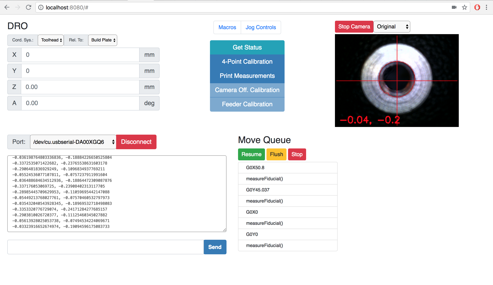

## Prototyping Assembly

#### [Project Page](https://gitlab.cba.mit.edu/assembledAssemblers/assembledAssembly)

In order to develop the automation for the new robotic building blocks, I'm going to re-tool the stapler assembler. This requires a number of upgrades and modifications including the [development of automatic part feeders](part_feeder/).

Since we're assembling systems from more than two part-types (likely ~5-10), rather than having an on-tool magazine of parts, the parts will be fed from stationary part-feeders from which the required toolhead will pickup and then place the part.

<video controls width="800px" src="part_feeder/video/strut_feeder_converted.mp4"></video>

 

I'm also developing a javascript interface to control the assembler and integrate feedback systems such as computer vision to detect (and possibly correct) errors.

<!-- This builds off previous work which developed assemblers for electronic digital materials:

<video controls src="../walking_motor/video/dual_stapler_cut3_converted.mp4" width="80%"></video> -->
