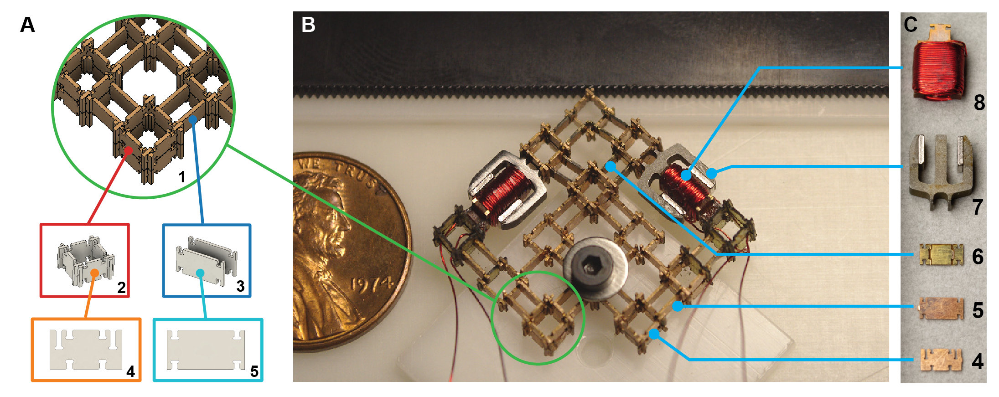
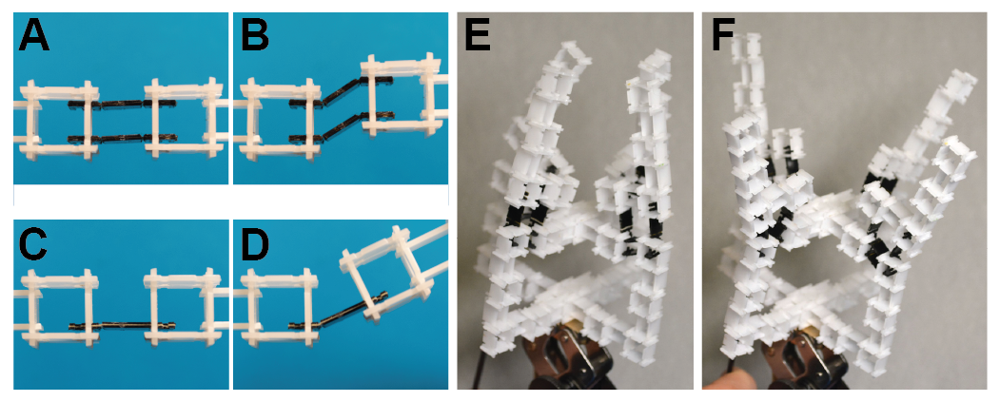
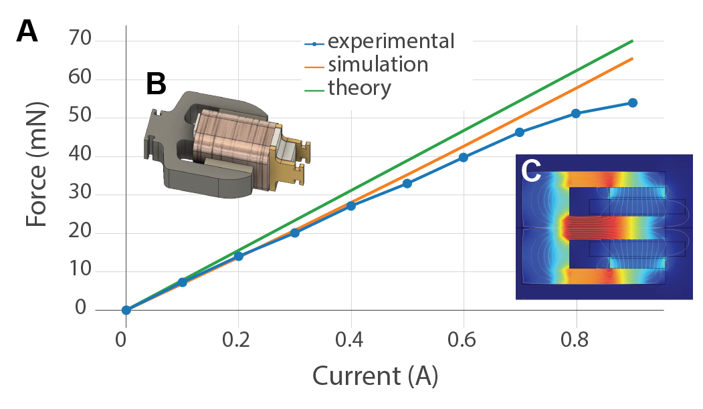
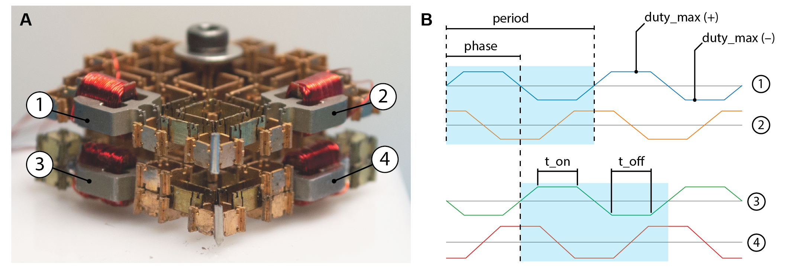
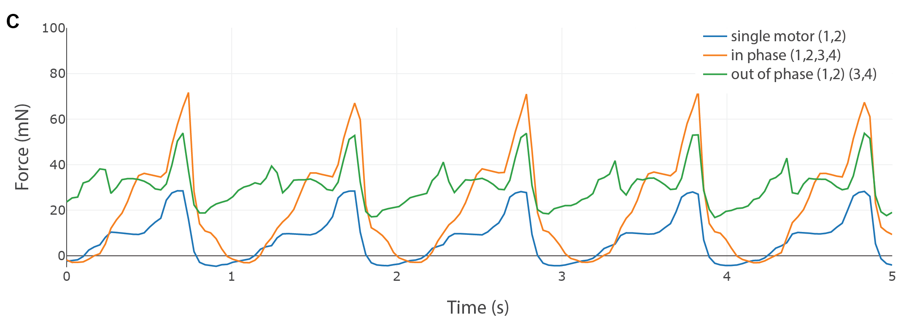
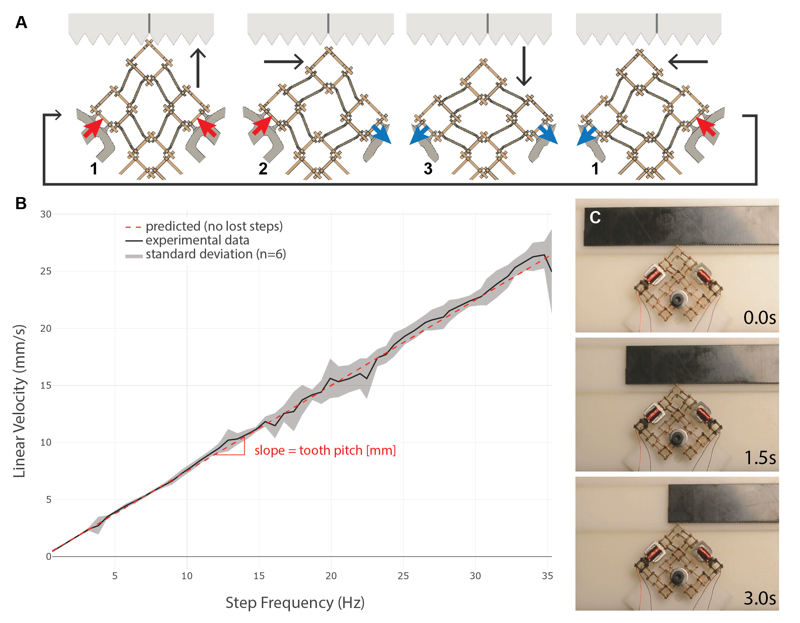

## Discretely Assembled Distributed Actuation Summary

#### [Project Page](https://gitlab.cba.mit.edu/assembledAssemblers/assembledActuation/tree/master/micro_walking_motor_v2)

We're demonstrating the assembly of electromechanical systems from a very limited set of parts. As a case study, we demonstrate the assembly of a "walking motor" capable of linear and rotary motion from just five basic part-types.

<video controls src="video/walking_motor_short_web.mp4" width="80%"></video>

### Mechanisms

By embedding degrees of freedom in the parts themselves, we can assemble mechanisms and linkages within the rectangular lattice framework, shown in Figure 2. With just two flexural part-types, a large range of mechanisms can be assembled. A single degree of freedom part is useful for establishing a pivot for rotational motion. A two degree of freedom part takes on a number of useful mechanism functions including simplifying the assembly of parallelogram linkages to approximate linear motion constraint.

### Actuation

With the addition of magnetic and coil parts we can assemble actuation to move the mechanisms. We settled on electromagnetic voice coil actuation as the most promising for embedding actuation into an assemble-able part. Electromagnetic actuators are used extensively at macro-scales but are less common at smaller scales because how energy-density scales. However, considering improved current capacities at smaller scales and with the use of permanent magnets, use of electromagnetic actuators can be extended down to much smaller sizes (22). The benefit of voice coil actuators over other electromagnetic actuators is that they can generate constant forces over large strokes and are capable of high-bandwidth operation. Voice coil actuators are also appealing because there are no attractive forces between the forcer and the stator. This means that there is no cogging forces and output force is exactly proportional to input current.

### Characterizing force

In the case of a single walking motor, it's impossible to generate continuous force since the motor tip needs to disengage from the rack in order to move to the next tooth. However, using multiple walking motors in a stacked configuration should enable this continuous force production. To achieve this, I implemented a parametrically defined trapezoidal trajectory. The result looks like the figure below.

To characterize the effects of phasing multiple walking motors, I measure the blocked force they produce. The walking motor is setup to drive a 30mm diameter rotor with a 50mm long lever arm. The lever arm then presses against the milligram load sensor to resolve the force the motor is exerting on the rotor.

These results match our expectations. When the two motors are driven in phase their peak force is approximately twice that of the single motor. When the two motors are driven out of phase, the force takes on an intermediate value with a smaller ripple, oscillating between 20mN and 50mN. The plot already takes into account the mechanical advantage of the testing setup (15mm/50mm).

### Characterizing speed and accuracy

I would like to measure the speed of the rotor slider across a range of step frequencies. I expect to see a line with slope equal to the pitch of the rotor teeth for a wide range of frequencies. Above some threshold frequency, I expect the motor to be unable to keep up and for the speed to drop to basically zero (or to be very intermittent).

The data matches our expectations quite well. We see that the slope does match the pitch of the rotor. Below 12Hz, there are almost no lost or skipped steps. Beyond 12Hz, there is a little more variability but overall pretty good agreement. 

### Next Steps

Next steps will involve integration of control and circuitry in the assemblies as well as the development of an automated means of assembly like we have done previously:

<video controls src="video/dual_stapler_cut3_converted.mp4" width="80%"></video>